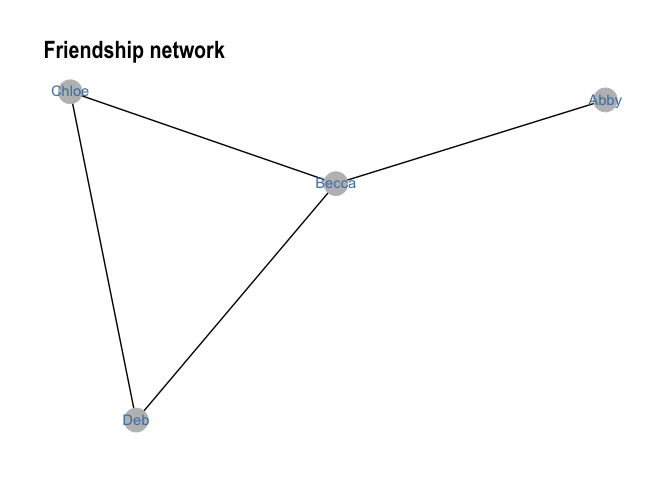
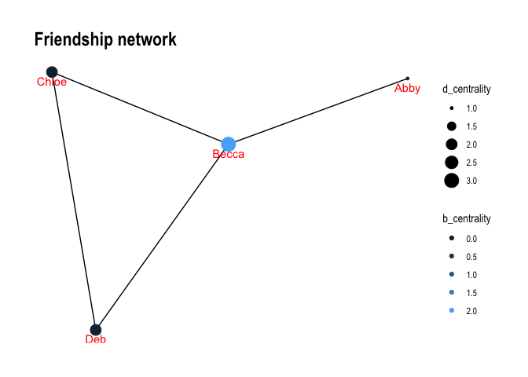

Exercise 4 quick start
================

## Illustration of friendship network

We’ll use `tidygraph` package to create and plot the friendship network
from the slides. The nodes are Abby (A), Becca (B), Chloe (C) and Deb
(D). Abby is only friends with Becca; Becca is friends with Abby, Chloe
and Deb; and Chloe and Deb and friends with Becca and each other (but
not Abby).

We’ll be relying on these tutorials:

-   <http://users.dimi.uniud.it/~massimo.franceschet/ns/syllabus/make/tidygraph/tidygraph.html>
-   <https://www.data-imaginist.com/2017/introducing-tidygraph/>
-   <https://www.data-imaginist.com/2018/tidygraph-1-1-a-tidy-hope/>

First, we define the network by manually entering all the nodes and the
connections between them. We’ll define `nodes` table that has two
columns: `id` and `name`. We will then define the connections among them
as an edgelist, where each element in column `from` corresponds to a
friend on one end of the relationship and each element in column `to`
corresponds to the person on the other end of this friendship tie.

``` r
# define nodes
node_names <- tibble(
  id   = c(1,2,3,4),
  name = c("Abby","Becca","Chloe","Deb")
)
node_names
```

    ## # A tibble: 4 × 2
    ##      id name 
    ##   <dbl> <chr>
    ## 1     1 Abby 
    ## 2     2 Becca
    ## 3     3 Chloe
    ## 4     4 Deb

``` r
# define connections (have to correspond to ties 1-2, 2-3, 2-4, 3-4)
# for each element in `from` there is a corresponding element in `to`
edge_list <- tibble(
  from = c(1,2,2,3),
  to   = c(2,3,4,4)
)
edge_list
```

    ## # A tibble: 4 × 2
    ##    from    to
    ##   <dbl> <dbl>
    ## 1     1     2
    ## 2     2     3
    ## 3     2     4
    ## 4     3     4

We can now combine these tables into a “graph” object that holds all of
our network data.

``` r
# combine this information into a network graph object
friendship_graph <- tbl_graph(nodes = node_names, edges = edge_list, directed = FALSE)
friendship_graph
```

    ## # A tbl_graph: 4 nodes and 4 edges
    ## #
    ## # An undirected simple graph with 1 component
    ## #
    ## # Node Data: 4 × 2 (active)
    ##      id name 
    ##   <dbl> <chr>
    ## 1     1 Abby 
    ## 2     2 Becca
    ## 3     3 Chloe
    ## 4     4 Deb  
    ## #
    ## # Edge Data: 4 × 2
    ##    from    to
    ##   <int> <int>
    ## 1     1     2
    ## 2     2     3
    ## 3     2     4
    ## # … with 1 more row

We can now plot this network using `ggraph` package.

``` r
friendship_graph %>% 
    ggraph(layout = 'kk') + 
    geom_edge_link() + 
    geom_node_point(size = 8, colour = 'gray') +
    geom_node_text(aes(label = name), colour = 'steelblue', vjust = 0.4) + 
    ggtitle('Friendship network') + 
    theme_graph()
```

<!-- -->

We can use many of the functions in package `tidy_graph` to calculate
things we want to know about this network. For example, we may want to
know the centrality of each node in the network.

``` r
friendship_graph <- friendship_graph %>% 
  activate(nodes) %>% # we need to state we'll be adding to nodes, not edges
  mutate(d_centrality = centrality_degree()) %>%  # adding measure of degree centrality
  mutate(b_centrality = centrality_betweenness()) # adding betweenness centrality
```

    ## Warning in betweenness(graph = graph, v = V(graph), directed = directed, :
    ## 'nobigint' is deprecated since igraph 1.3 and will be removed in igraph 1.4

``` r
friendship_graph
```

    ## # A tbl_graph: 4 nodes and 4 edges
    ## #
    ## # An undirected simple graph with 1 component
    ## #
    ## # Node Data: 4 × 4 (active)
    ##      id name  d_centrality b_centrality
    ##   <dbl> <chr>        <dbl>        <dbl>
    ## 1     1 Abby             1            0
    ## 2     2 Becca            3            2
    ## 3     3 Chloe            2            0
    ## 4     4 Deb              2            0
    ## #
    ## # Edge Data: 4 × 2
    ##    from    to
    ##   <int> <int>
    ## 1     1     2
    ## 2     2     3
    ## 3     2     4
    ## # … with 1 more row

Now let’s plot this with degree centrality determining the size of the
nodes and betweenness determining its color.

``` r
friendship_graph %>% 
  ggraph(layout = 'kk') + 
  geom_edge_link() + 
  geom_node_point(aes(size = d_centrality, colour = b_centrality)) + 
  scale_color_continuous(guide = 'legend') +
  geom_node_text(aes(label = name), colour = 'red', vjust = 1.6) + 
  ggtitle('Friendship network') + 
  theme_graph()
```

<!-- -->
